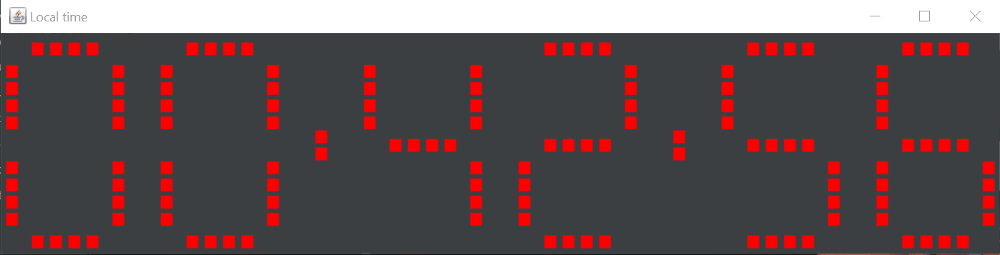

# Clock
An antique style 7-segment display digital clock on a Java JFrame.

## Purpose
The idea for this came from learning how Hex characters are stored in 4 bits, and how they can be displayed in 7-part LEDs with the help of a [4 to 7 demux](http://electronics-course.com/demux). I thought it'd be fun to simulate this logic in Java, and so I created this simple program that runs through the process.

It first takes the current time and separates each digit. Then converts those to an array of 4 booleans to represent the 4 bits of the char. Meanwhile a display with 6 zeros, each with 7 parts, stays off (same color as background) until a signal arrives to light up each part according to the array of booleans. It then repeats this every second to keep the clock flowing.

## Usage
Just run the compiled jar, or use the source code to integrate your own 7 segment display onto another project.
